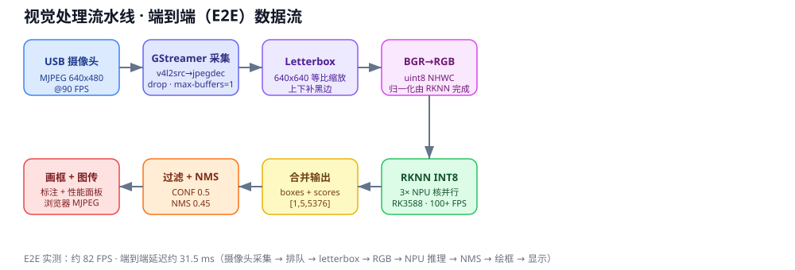

# 2026 电子设计竞赛 H 题 · 车载平衡滚球视觉系统

> **标识**：2026 年全国大学生电子设计竞赛（电赛）H 题 —— 车载平衡滚球运动控制系统 · 视觉子系统
> **获奖**：四川省一等奖
> **平台**：香橙派 5 Pro（RK3588）· YOLO ONNX / RKNN INT8 实时部署
> **核心**：钢珠检测与定位 · 三核 NPU 并行推理 · 端到端低延迟优化

---

## 系统架构



摄像头画面经 **GStreamer 采集 → letterbox 归一化 → 3× NPU 核并行 RKNN INT8 推理 → 输出合并与 NMS → 绘制标注 + 浏览器图传**，端到端实测约 **82 FPS / 延迟 31.5 ms**。

---

## YOLO 钢珠检测：ONNX、RKNN INT8 与香橙派部署

本文记录钢珠检测模型从数据集训练到香橙派 5 Pro（RK3588）实时部署的完整流程，并总结模型转换、INT8 量化、多核 NPU、USB 摄像头和端到端性能优化中的关键点。

## 1. 最终方案概览

```text
YOLO 数据集
  -> Ultralytics 训练 best.pt
  -> 导出 best.onnx（opset 12，640x640）
  -> 拆分 boxes 与 scores 输出
  -> 使用 letterbox 校准图进行 INT8 量化
  -> ball_best_int8_split.rknn
  -> RK3588 三个 NPU 核并行推理
  -> GStreamer 读取 USB MJPEG 摄像头
  -> 显示检测框、E2E FPS 和端到端延迟
```

最终检测程序：

```text
C:\Users\baixi\Desktop\视觉\camera_detect.py
```

香橙派上的程序与模型：

```text
/home/orangepi/camera_detect.py
/home/orangepi/ball_best_int8_split.rknn
```

## 2. 目录与主要文件

数据集目录：

```text
D:\py_pro\27yolo\ball2
├── images\                 # 447 张 640x480 图像
├── labels\                 # YOLO 格式标签
├── data.yaml
└── .avls\runs\quick_train\weights\
    ├── best.pt
    └── best.onnx
```

本项目脚本：

| 文件 | 作用 |
|---|---|
| `train_ball_pt.py` | 从数据集训练并生成 `best.pt` |
| `ball2_data.yaml` | 使用当前真实数据集路径的 YOLO 配置 |
| `export_onnx.py` | 将 `best.pt` 导出为 ONNX |
| `prepare_ball_calibration.py` | 生成与运行时一致的 640x640 letterbox 校准图 |
| `split_yolo_output.py` | 将 YOLO 的 boxes 与 scores 设置为独立 ONNX 输出 |
| `convert_ball_int8_split.py` | 生成最终 INT8 RKNN 模型 |
| `camera_detect.py` | 香橙派实时检测程序 |
| `compare_rknn_outputs.py` | 对比 FP16 和 INT8 输出范围 |
| `benchmark_rknn_workers.py` | 测试 1/2/3 个 NPU Runtime 的吞吐量 |
| `benchmark_camera.py` | 对比 GStreamer 与 OpenCV V4L2 摄像头帧率 |

## 3. 数据集与训练

数据集使用标准 YOLO 检测格式：

```text
images/object_xxx.jpg
labels/object_xxx.txt
```

每个标签行格式：

```text
class_id center_x center_y width height
```

坐标均为相对图像宽高归一化后的 `0~1` 数值。本数据集只有一个类别：

```yaml
names:
  0: ball
```

训练脚本使用的主要参数：

```text
模型：yolov8n.pt
输入：640x640
epochs：100
batch：16
device：0（CUDA GPU）
workers：2
AMP：开启
```

运行：

```powershell
python "C:\Users\baixi\Desktop\视觉\train_ball_pt.py"
```

输出模型：

```text
D:\py_pro\27yolo\ball2\.avls\runs\quick_train_v2\weights\best.pt
```

注意：当前训练集和验证集都指向 `images`。这适合快速实验，但正式评估应将图像拆分为独立的 `train` 和 `val`，否则验证结果会偏乐观。

## 4. PT 导出 ONNX

最终 ONNX 模型信息：

```text
输入名称：images
输入形状：[1, 3, 640, 640]
输出名称：output0
输出形状：[1, 5, 8400]
类别数：1（ball）
opset：12
task：detect
```

输出张量含义：

```text
output0[:, 0:4, :] = xc, yc, width, height
output0[:, 4,   :] = ball confidence
```

导出时使用固定输入尺寸、batch 1、无内置 NMS：

```python
model.export(format="onnx", opset=12, simplify=True)
```

固定尺寸模型在 RKNNLite 启动时可能显示：

```text
query RKNN_QUERY_INPUT_DYNAMIC_RANGE error
```

这是静态模型的提示，可以忽略，不影响 `640x640` 推理。

## 5. 为什么普通 INT8 量化完全检测不到

原始 YOLO 输出将两种数量级差异很大的数据拼在同一个张量中：

```text
坐标值：最高约 652
置信度：0~1
```

普通 INT8 量化对整个 `[1,5,8400]` 输出使用共同量化尺度。为了表示几百大小的坐标值，量化步长会变大，远小于 1 的置信度因此全部舍入为零。

实测结果：

```text
FP16 confidence max：0.883789
INT8 confidence max：0.000000
```

这不是阈值问题。即使把 `CONF_THRESH` 调到很低，也无法恢复已经量化为零的信息。

### 最终解决方案：拆分输出

ONNX 最后一层原本是：

```text
boxes -> Concat -> output0
scores -> Concat -> output0
```

`split_yolo_output.py` 直接将最终 `Concat` 之前的两个张量设为模型输出：

```text
boxes： [1,4,8400]
scores：[1,1,8400]
```

这样 RKNN 可以分别为坐标与置信度选择量化尺度，避免小数置信度被坐标范围吞没。板端收到两个输出后再拼接：

```python
out = np.concatenate((outputs[0], outputs[1]), axis=1)
```

这是本项目 INT8 量化中最重要的处理。

## 6. 校准数据与 letterbox

原始数据集图像为 `640x480`，模型输入为 `640x640`。运行时采用保持宽高比的 letterbox：

1. 按比例缩放图像。
2. 居中放入 `640x640` 黑色画布。
3. 本数据集实际会在上下各补约 80 像素黑边。

量化校准图必须尽可能匹配实际推理输入。如果直接让量化工具把 `640x480` 拉伸到 `640x640`，校准分布与运行时不一致，会损失小目标精度。

生成校准集：

```bash
python3 ~/prepare_ball_calibration.py
wc -l ~/ball_dataset_640.txt
```

如果 WSL 在大量校准图或 MMSE 量化时内存压力过大，可从生成好的校准图中抽取 100 张：

```bash
find ~/ball_calibration_640 -type f -iname "*.jpg" \
  | shuf -n 100 > ~/ball_dataset_640.txt
```

校准图应覆盖真实部署中的光照、位置、大小、背景和钢珠数量变化。

## 7. 生成最终 INT8 RKNN

在 WSL 中：

```bash
source ~/rknn_env/bin/activate

python3 ~/split_yolo_output.py

OPENBLAS_NUM_THREADS=2 OMP_NUM_THREADS=2 \
python3 ~/convert_ball_int8_split.py
```

输出：

```text
/home/baixiang/ball_best_int8_split.rknn
```

上传到香橙派：

```bash
scp ~/ball_best_int8_split.rknn orangepi@10.134.63.31:~/
```

原 FP16 模型也应保留，便于精度回退：

```text
/home/orangepi/ball_best.rknn
```

## 8. 板端预处理与后处理

### 输入预处理

RKNN 转换时配置：

```python
mean_values=[[0, 0, 0]]
std_values=[[255, 255, 255]]
```

因此板端输入使用 RGB `uint8 NHWC`，归一化由 RKNN 完成：

```python
inp = cv2.cvtColor(inp, cv2.COLOR_BGR2RGB)
inp = np.expand_dims(inp, axis=0)
outputs = rknn.inference(inputs=[inp], data_format=["nhwc"])
```

不要再手动除以 `255`，也不要转成 NCHW，否则会重复归一化或输入布局错误。

### 输出后处理

主要步骤：

1. 合并 `boxes` 与 `scores`。
2. 使用置信度阈值过滤候选框。
3. 将 `xc, yc, w, h` 转为 `x1, y1, x2, y2`。
4. 撤销 letterbox 的缩放和偏移。
5. 使用 NMS 去除重叠检测框。

当前参数：

```text
CONF_THRESH = 0.5
NMS_THRESH  = 0.45
```

OpenCV `NMSBoxes` 需要 `[x, y, width, height]`，不能直接传 `[x1, y1, x2, y2]`。

## 9. RK3588 三核 NPU 并行

RK3588 有三个 NPU 核。程序为每个核心创建独立 RKNNLite Runtime：

```text
worker 0 -> NPU_CORE_0
worker 1 -> NPU_CORE_1
worker 2 -> NPU_CORE_2
```

每个工作线程从共享队列获取不同帧，实现帧级流水线并行。队列满时丢弃最旧帧，以降低实时延迟，而不是积压过期画面。

INT8 模型基准：

| 工作线程 | 总吞吐量 |
|---:|---:|
| 1 | 39.39 FPS |
| 2 | 76.68 FPS |
| 3 | 106.75 FPS |

单核平均推理时间约：

```text
1000 / 39.39 = 25.4 ms
```

三核 `106.75 FPS` 表示总吞吐量，不表示单帧延迟为 `9.37 ms`。单帧仍需要约 25 ms，只是三个核心可以同时处理不同帧。

## 10. USB 摄像头与 GStreamer

USB 全局快门摄像头节点：

```text
/dev/video0
/dev/video1
```

图像采集节点为 `/dev/video0`。摄像头支持 `640x480 MJPG @ 90 FPS`。

实测：

| 采集方式 | 实际帧率 |
|---|---:|
| OpenCV V4L2 MJPG | 42.20 FPS |
| GStreamer MJPG | 88.48 FPS |

因此正式程序使用 GStreamer：

```text
v4l2src -> MJPEG -> jpegdec -> BGR -> appsink
```

关键配置：

```text
drop=true
max-buffers=1
sync=false
```

这些设置避免旧帧堆积，优先保证低延迟。若 GStreamer 打开失败，程序会自动回退到 OpenCV V4L2。

## 11. FPS 与延迟指标

程序显示四类性能数据：

```text
E2E: 82 FPS  Lat: 31.5 ms
NPU: 86  CAM: 89  Balls: 1  Max: 0.82
```

### CAM

摄像头成功读取并解码的帧率。它只代表输入能力，不包含模型推理。

### NPU

三个推理线程完成预处理、NPU 推理和后处理的总吞吐量。它不是单帧延迟。

### E2E

新的检测结果真正提交到 `cv2.imshow()` 的帧率，包含：

```text
摄像头采集
-> 排队
-> letterbox
-> BGR 转 RGB
-> NPU 推理
-> 后处理与 NMS
-> 绘框
-> 显示提交
```

这是程序层面最接近实际端到端处理能力的帧率。

### Lat

从 `cap.read()` 得到该帧到准备提交显示的时间。它不包含显示器面板自身的扫描刷新延迟。

最终有效帧率通常受最慢环节限制：

```text
有效吞吐约等于 min(CAM, NPU, 显示能力)
```

## 12. 性能结论

本次优化得到的关键结论：

1. INT8 模型单核推理比 FP16 明显更快。
2. 三核 NPU 的纯模型吞吐可超过 100 FPS。
3. OpenCV V4L2 摄像头链路会把系统限制在约 42 FPS。
4. GStreamer 将 USB 摄像头实际采集提升到约 88 FPS。
5. 摄像头标称帧率、NPU 吞吐和端到端帧率是三个不同概念。
6. 实时系统应丢弃旧帧，避免通过排队制造“高吞吐、长延迟”。

## 13. 常用命令

上传程序：

```bash
scp "/mnt/c/Users/baixi/Desktop/视觉/camera_detect.py" \
  orangepi@10.134.63.31:~/camera_detect.py
```

登录香橙派：

```bash
ssh orangepi@10.134.63.31
```

运行：

```bash
cd /home/orangepi
python3 camera_detect.py
```

检查程序与模型：

```bash
ls -lh ~/camera_detect.py ~/ball_best_int8_split.rknn
grep -n "^MODEL_FILE\|^NPU_WORKERS" ~/camera_detect.py
```

摄像头性能测试：

```bash
python3 ~/benchmark_camera.py
```

NPU 并行性能测试：

```bash
python3 ~/benchmark_rknn_workers.py
```

正常退出请在检测窗口按 `ESC`。终端强制按 `Ctrl+C` 可能在旧版本脚本中导致后台 NPU/摄像头线程未完成清理。

## 14. 最终推荐文件

正式部署只需要重点保留：

```text
camera_detect.py
ball_best_int8_split.rknn
```

若需要重新训练和转换，则同时保留：

```text
train_ball_pt.py
ball2_data.yaml
export_onnx.py
prepare_ball_calibration.py
split_yolo_output.py
convert_ball_int8_split.py
```

不推荐继续使用普通单输出 INT8 模型：

```text
ball_best_int8.rknn
ball_best_int8_v2.rknn
```

这两个模型会因为 boxes 与 scores 共用输出量化尺度，导致置信度被量化为零。

## 安全

安全策略见 [SECURITY.md](SECURITY.md)。本项目纯本地运行（香橙派 5 Pro + 局域网），不依赖公网，不采集任何用户数据；模型为预编译产物，输入输出均为本地摄像头画面。
